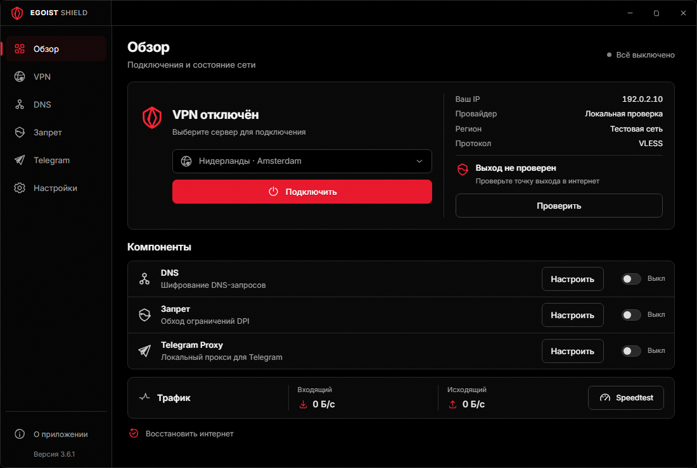
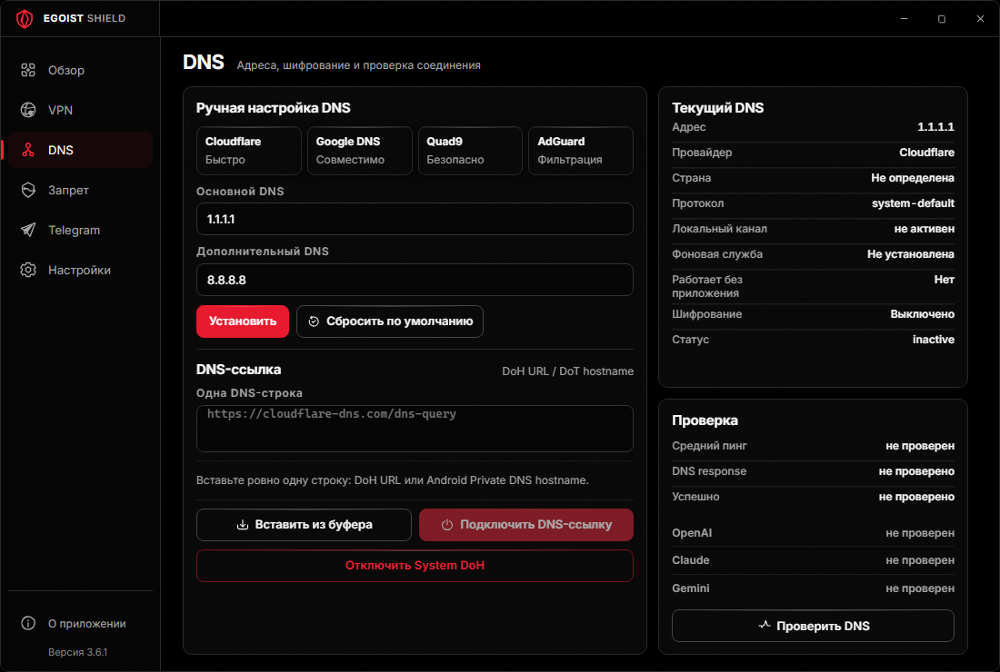
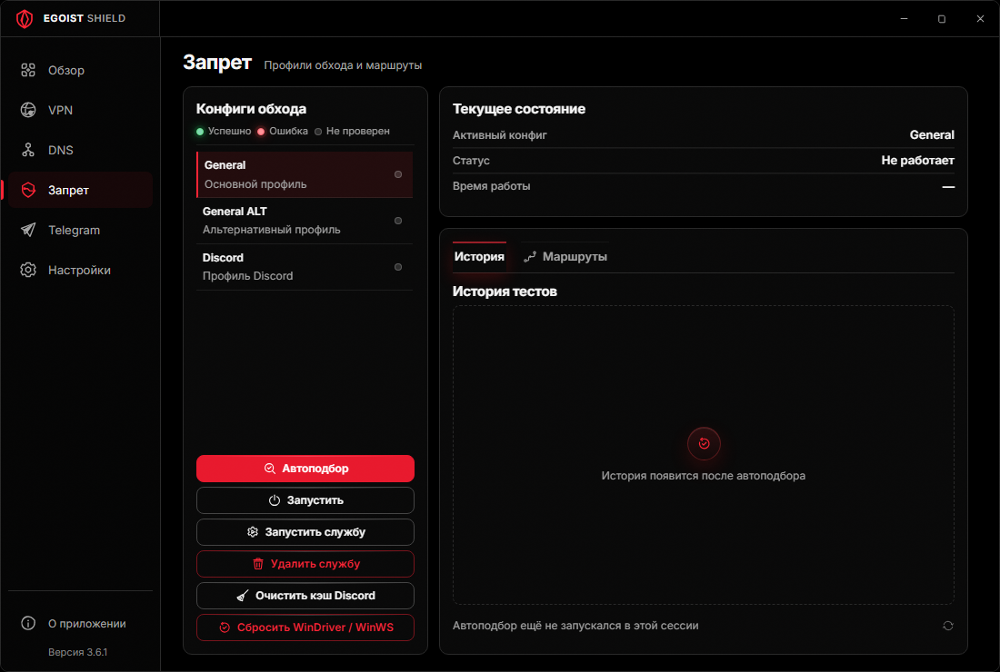

<div align="center">
  
  <h1>Egoist Shield</h1>
  <p><strong>Единый командный центр сетевой защиты Windows.</strong></p>
  <p>VPN, DNS/DoH, Запрет, Telegram Proxy и проверяемое восстановление сети — в одном компактном приложении.</p>

  <p>
    <a href="https://github.com/egoist-ai1/egoistshield/releases/latest"></a>
    <a href="https://github.com/egoist-ai1/egoistshield/actions/workflows/verify-release.yml"></a>
    
    <a href="LICENSE.txt"></a>
  </p>

  <p>
    <a href="https://github.com/egoist-ai1/egoistshield/releases/latest"><strong>Скачать последнюю версию</strong></a>
    · <a href="docs/troubleshooting.md">Решение проблем</a>
    · <a href="CHANGELOG.md">История изменений</a>
    · <a href="https://boosty.to/eg01stgames"><strong>Поддержать автора</strong></a>
  </p>
</div>



Компактный интерфейс с чистым чёрным фоном, алыми действиями и отдельными SVG-иконками. Подсказки и диалоги доступны с клавиатуры и при масштабе 200%. На иллюстрациях используются демонстрационные данные.

## Что умеет Egoist Shield

- **VPN.** Импортирует подписки, управляет соединением и проверяет выход в интернет через выбранный сервер.
- **DNS и DoH.** Применяет DNS и DoH к сетевому адаптеру, проверяет разрешение адресов и восстанавливает исходные настройки.
- **Запрет.** Проверяет все встроенные профили, сравнивает полноту доступа и задержку, затем выбирает лучший результат.
- **Telegram Proxy.** По запросу устанавливает собственную службу и проверяет локальный порт и upstream-маршрут. При чистой установке компонент выключен до выбора пользователя.
- **Восстановление интернета.** Откатывает только состояние, которым владеет Egoist Shield, не стирая здоровый внешний DNS или чужой VPN.

<table>
  <tr>
    <td width="50%"><strong>DNS / DoH</strong><br />Проверяемое применение и понятный статус источника.</td>
    <td width="50%"><strong>Запрет</strong><br />Полный sweep профилей вместо остановки на первом удачном.</td>
  </tr>
  <tr>
    <td></td>
    <td></td>
  </tr>
</table>

## Доверенное обновление

Начиная с 3.5.0 кнопка «Проверить и обновить» выполняет одну атомарную операцию:

```text
stable channel → Ed25519 → size/SHA-256/SHA-512/GitHub digest
              → загрузка .partial → повторная проверка candidate
              → транзакционная установка → перезапуск или rollback
```

Renderer не получает URL, хэш или команду запуска. Старый или подменённый manifest, неизвестный/revoked key, downgrade, изменившийся asset и неожиданный redirect блокируются до запуска EXE.

## Установка

1. Откройте [последний GitHub Release](https://github.com/egoist-ai1/egoistshield/releases/latest).
2. Скачайте `EgoistShield-Setup-<version>.exe`.
3. Сверьте SHA-256 с одноимённым `.sha256` и подписанным `release-manifest.json`.
4. Запустите Setup и подтвердите штатный UAC.

Сборка предназначена для Windows 10/11 **x64**. VPN, DNS/DoH, Telegram Proxy и Запрет при чистой установке выключены; включите нужные функции в приложении. Установщик восстанавливает принадлежащие Shield сетевые настройки и проверяет новую Core-службу до завершения обновления.

Версия 3.6.1 не имеет CA-trusted Authenticode-подписи. Windows может показать SmartScreen. Ed25519-манифест и хэши подтверждают целостность релиза, но не заменяют подпись издателя Windows.

**Переход на 3.6.1 выполняется вручную.** Прежние ключи подписи утеряны вместе с исходными данными проекта. Новый установщик закрепляет новый корневой ключ; старые клиенты корректно отклонят его автоматическое обновление. Не отключайте проверку подписи. Подробности и отпечаток: [смена ключа доверия](docs/trust-bootstrap-3.6.md).

## Приватность и безопасность

- Настройки, журналы и подписки остаются локально; диагностические сообщения скрывают секреты.
- Системные операции выполняются allowlisted Core-службой, а не произвольным PowerShell из UI.
- Установка/удаление затрагивает только компоненты с доказанным Egoist Shield ownership.
- Исходный код продукта остаётся приватным; этот репозиторий содержит только release metadata, проверяемые артефакты и документацию.

Подробнее: [SECURITY.md](SECURITY.md), [PRIVACY.md](PRIVACY.md), [THIRD-PARTY-NOTICES.txt](THIRD-PARTY-NOTICES.txt).

## Поддержать автора

<p align="center">
  <a href="https://boosty.to/eg01stgames" title="Поддержать Egoist Ai One на Boosty">
    
  </a>
</p>
