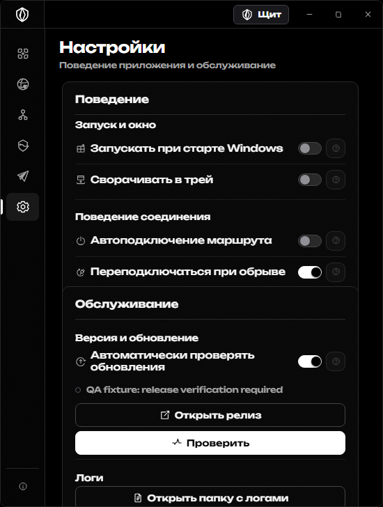
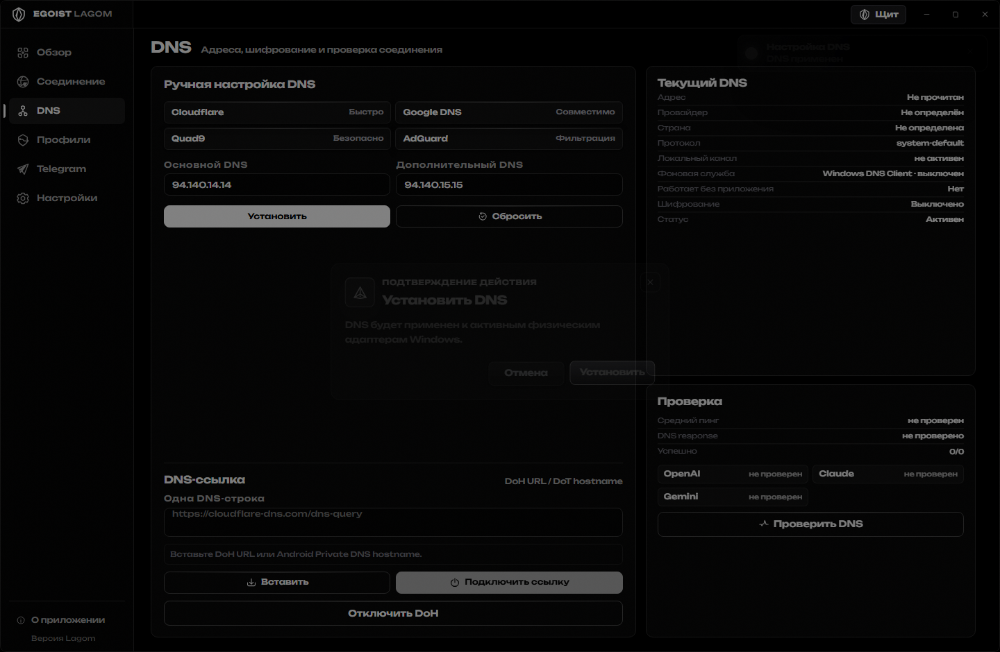
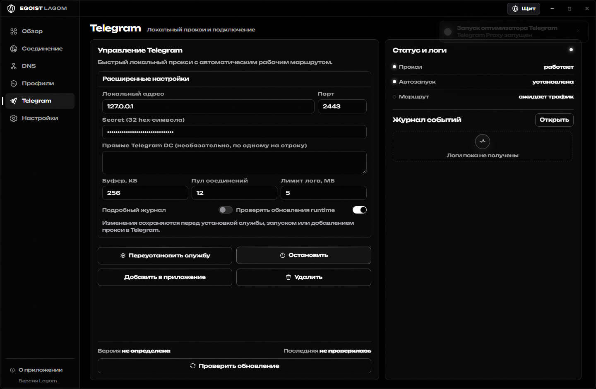

<div align="center">
  
  <h1>Egoist Lagom</h1>
  <p><strong>Спокойный командный центр сетевых настроек Windows.</strong></p>
  <p>Лаконичный чёрно-белый интерфейс, локальные профили соединения, DNS/DoH, Telegram Proxy и понятное обслуживание служб.</p>

  <p>
    <a href="https://github.com/egoist-ai1/egoist-lagom/releases/latest"></a>
    <a href="https://github.com/egoist-ai1/egoist-lagom/actions/workflows/ci.yml"></a>
    
    
  </p>

  <p>
    <a href="https://github.com/egoist-ai1/egoist-lagom/releases/latest"><strong>Скачать Egoist Lagom</strong></a>
    · <a href="docs/reliability-3.7.8/README.md">Аудит 3.7.8</a>
    · <a href="docs/release-notes-3.7.8.md">Что нового</a>
    · <a href="docs/troubleshooting.md">Решение проблем</a>
  </p>
</div>



Egoist Lagom создан для людей, которым нужен быстрый и аккуратный контроль локальных сетевых настроек. Все необязательные компоненты выключены после чистой установки и включаются только по действию пользователя.

Сборка 3.7.8 объединяет актуальную Windows-разработку Lagom и Shield, установлена и проверена локально. Публичный stable канал пока не переключался. Подробные исправления, результаты испытаний и ограничения находятся в [отчёте 3.7.8](docs/reliability-3.7.8/README.md). Переход со старых версий требует ручного проверенного установщика: закрытый ключ прежнего контура обновлений не найден, новый открытый корень включён в 3.7.8. Проверка подписей остаётся обязательной.

## Возможности

- **Профили соединения.** Импорт, выбор и проверка сохранённых конфигураций.
- **DNS и DoH.** Применение выбранных адресов, проверка readback и восстановление исходных параметров адаптера.
- **Telegram Proxy.** Локальная служба для Telegram с проверкой порта, состояния и журнала.
- **Службы Windows.** Установка, запуск, остановка и удаление собственных служб через один транзакционный Core.
- **Восстановление.** Возврат только изменений Egoist Lagom с сохранением внешних пользовательских настроек.
- **Диагностика.** Локальные журналы, компактные результаты проверок и нейтральные сообщения об ошибках.

Установленные автоматические службы DNS, Telegram и Zapret контролирует Core, запускаемый Windows без открытия интерфейса. Явное выключение компонента сохраняется. Восстановление ограничено проверкой ownership, журналом и интервалами повторов; отказ внешнего сервера не устраняется перезапуском локальной службы. VPN и его повторное подключение пока требуют работающего приложения. Локальный Xray DNS обслуживает A/AAAA; для полной поддержки типов DNS при новой стандартной конфигурации предпочтителен native Windows DoH.

## Интерфейс

Все экраны используют одну систему: чёрный фон, белая типографика, тонкие серые границы и короткие анимации на `opacity`/`transform`. Узкие окна, клавиатурный фокус, Escape, reduced motion и масштаб 200% входят в проверочный набор.

<table>
  <tr>
    <td width="50%"></td>
    <td width="50%"></td>
  </tr>
  <tr>
    <td align="center">DNS и проверка соединения</td>
    <td align="center">Telegram Proxy и журнал</td>
  </tr>
</table>

## Установка

1. Откройте [последний релиз](https://github.com/egoist-ai1/egoist-lagom/releases/latest).
2. Скачайте версионированный `EgoistShield-Setup-<версия>.exe` и одноимённый файл `.sha256`.
3. Сверьте SHA-256.
4. Запустите установщик и подтвердите штатный запрос Windows UAC.

Поддерживается Windows 10/11 x64. Установщик работает с правами администратора, освобождает только собственные компоненты Egoist Lagom и сохраняет пользовательские настройки сторонних программ.

## Сборка

Проверено с Node.js 24.19.0, Python 3.11+, .NET SDK 10.0.401 / runtime 10.0.12 и NSIS 3. Для упаковки нужны восстановленный официальный Electron payload и проверенные runtime archives. Задайте абсолютный `SHIELD_EVIDENCE_DIR` в каталоге текущей задачи. SDK выбирается через `global.json`; `SHIELD_DOTNET` позволяет указать отдельную установленную копию.

```powershell
npm ci
npm run build
npm test
npm run package:win
```

`npm run package:win` создаёт EXE, SHA-256 и `package-integrity.json` локально в `dist/`. Большие generated-папки и локальные ключи исключены из Git.

## Проверка

Итоговые счётчики и воспроизведения ошибок приведены в [отчёте 3.7.8](docs/reliability-3.7.8/README.md); история стабильного релиза — в [проверке 3.7.7](docs/validation-3.7.7.md). CI выполняет Node, C# и Windows PowerShell проверки. Локальные лаборатории и виртуальное время не подтверждают месяцы непрерывной эксплуатации или реальные перезагрузки Windows.

## Приватность и лицензия

Состояние, журналы и конфигурации хранятся локально. Диагностические архивы скрывают секреты; перед публикацией любого журнала проверьте его содержимое.

Проект предназначен для управления компьютерами и службами, которыми вы владеете или которыми вам разрешено управлять. См. [PRIVACY.md](PRIVACY.md), [SECURITY.md](SECURITY.md), [THIRD-PARTY-NOTICES.txt](THIRD-PARTY-NOTICES.txt) и [LICENSE.txt](LICENSE.txt).
