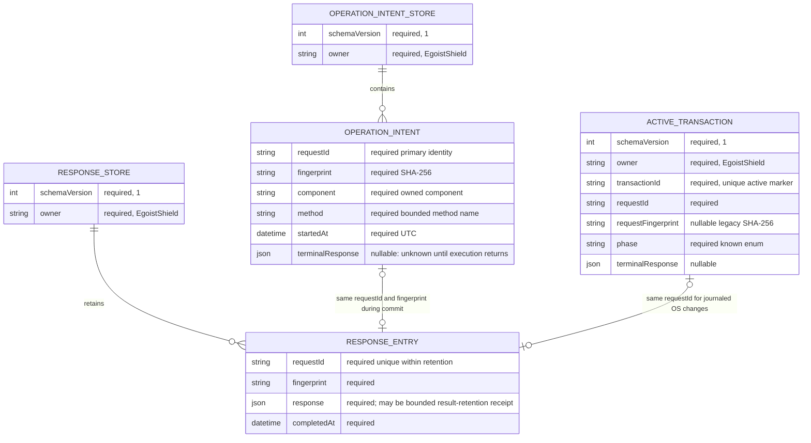

# Core persistence changes

Scope: typed reads and durable component-operation intent. Existing transaction, DNS ownership and service-intent files stay in place. Corrupt or unavailable files never become an empty state; their bytes are preserved. This design is recorded before adding the new persisted entity.

`operation-intents.json` contains component intents only. One Core mutation slot serializes their creation. An intent is durably flushed before the external executor runs. It remains until a bounded terminal response is durably stored. If the process stops, the executor loses its response, or a persistence write fails, replay is refused while the intent remains. A read-only status observation is evidence about current state, not proof of the historical operation outcome and never clears an unresolved intent.

Durable response retention has explicit count and byte bounds. Oversized completed results become a compact receipt that refuses re-execution; the first caller still receives the complete in-memory result after durable commit. Response eviction ends the supported replay-retention window. Unresolved intents are never evicted to free space; exceeding their capacity blocks new mutation. This is bounded replay protection, not a claim of permanent exactly-once execution.

Diagnostics expose state kind, safe error category, bounded file length/hash when read, pending request identity and a read-only component observation. They do not export raw payloads or corrupted bytes. Recovery of known active transactions retains existing ownership/post-state checks. Foreign, malformed or unsupported active markers are preserved and cannot authorize rollback.
