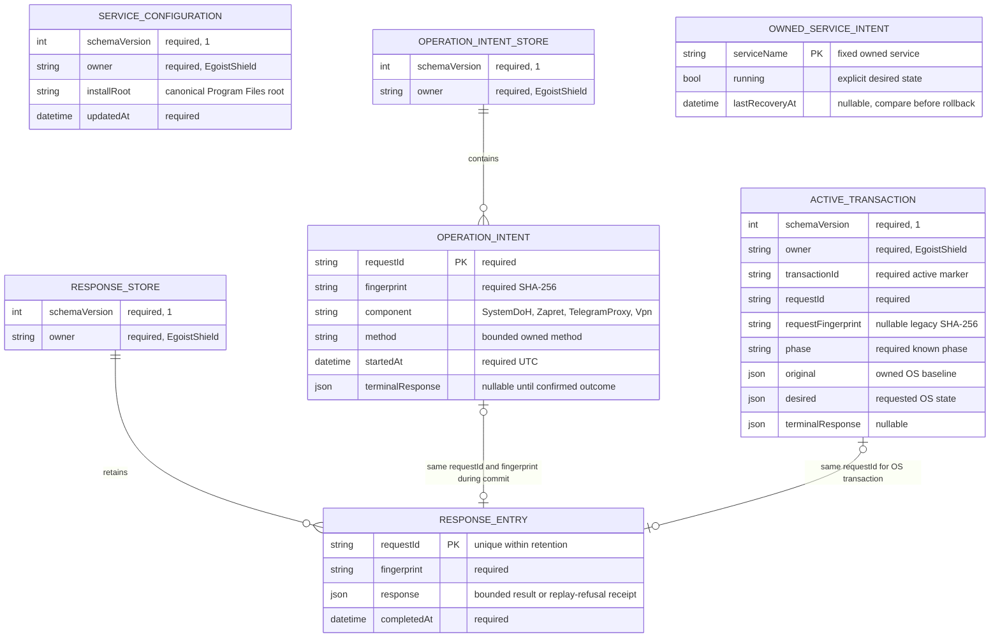

# Core: модель сохранённого состояния

Состояние операций сохраняется отдельно от конфигурации установки и желаемого состояния фоновых служб. Повреждённое или недоступное состояние сохраняется для диагностики и не разрешает исполнение. Ключ корреляции запроса — `requestId` и SHA-256 отпечаток его содержимого.

`SERVICE_CONFIGURATION` identifies the executable installation, not a request-selected root. Corrupt configuration permits diagnostic startup only. The fallback for GUI trust uses the actual Core executable at its expected protected installed location; it never trusts the client root or corrupt file contents. `OWNED_SERVICE_INTENT` is deliberately not an operation completion record: a current Running/Stopped observation cannot establish a historical operation outcome.

One mutation slot serializes the durable component protocol:

1. Validate state, completed-response retention and request fingerprint.
2. Persist the operation intent before invoking the executor.
3. Persist the confirmed terminal response in the intent.
4. Commit the bounded replay response, then retire the matching intent.

Startup, supervision and the next mutation may finish steps 3–4 for already confirmed terminal responses without invoking the executor. They then retain and report any unknown sibling intent. The current request's committed response is reread after this reconciliation, before executing it. No status observation clears an unknown intent.

VPN desired Running is written before explicit install/start; Off is written before stop/remove. A prior intent is restored only after a confirmed pre-effect validation failure or verified native rollback and only when the current saved value still matches the expected just-written value. A newer Off wins; an uncertain rollback retains the unknown-operation barrier.

The durable response store is bounded to 512 entries and 4 MiB, with a 256 KiB retained response limit. The in-memory response cache is bounded to 8 MiB. Unresolved intents are never evicted; 128-entry/4 MiB capacity exhaustion refuses new mutation. Completed response eviction ends the replay-support window and does not establish permanent exactly-once execution.

The component intent stores no raw args/config before an effect. Terminal responses, response-store data and OS original/desired snapshots can still contain secrets. All Service state therefore requires a private SY/BA DACL; runtime-secret protection and its native ACL acceptance are owned by the separate VPN/private ACL implementation. The Core pipe remains the authorized GUI access boundary. Console fixtures are not evidence of LocalSystem ProgramData ACL protection.

64 fixed path-lock stripes synchronize cooperating Core JSON read/write generations without an unbounded path-key dictionary. Read state remains Missing/Valid/Unavailable/Corrupt, preserving corrupt bytes and differentiating transient sharing denial. A Stopwatch-based 30-second route cache does not depend on wall-clock time.

Accepted behavior and source generations: [core-report.md](core-report.md), [core-validation.json](core-validation.json).
