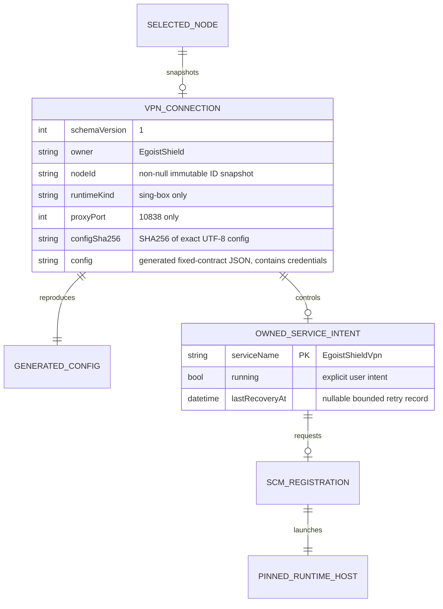

# Background VPN state

The opt-in background mode is a separate owned Windows service, `EgoistShieldVpn`. It runs TUN only; it does not write an interactive user's system proxy. Existing users are not enrolled automatically. Temporary GUI VPN and the background service must have a confirmed stopped handoff before starting the other mode.

`Service/Vpn/connection.json` is the persisted connection; `Runtime/Vpn/config.json`, wrapper XML and bounded logs are derived artifacts. Both Vpn directories deny inherited interactive-user access and permit only SYSTEM and Administrators. The existing `service-supervision.json` stores running intent without secrets. The connection has no executable/config path supplied by the caller. Its node ID is a snapshot reference, not a live foreign key: subscription refresh or removal never changes a running service silently.

The fixed wrapper runs the installed Core helper with the sole argument `--run-vpn-runtime`. The helper checks its installed location, protected connection identity and content, exact generated config hash, and holds the installed native runtime inventory and config files through the child lifetime. The only privileged runtime is the installed pinned sing-box. Custom runtimes, unsupported sing-box transports, and the GUI-only firewall kill switch are rejected explicitly. Start/stop/remove remain serialized authenticated Core operations. Unknown ownership, read failures, endpoint conflict, or unconfirmed stop prevent a competing runtime or automatic restart.

An installer must preserve `Service/Vpn` and the existing running intent across update and rollback. It must preserve/recreate the generated wrapper directory before restoring an installed service's prior running state. A missing generated config can be reconstructed from the protected connection by the fixed host. Uninstall removes only this allowlisted service and its dedicated state after confirming stopped state.

Validation receipts distinguish controlled contract/lifecycle tests, real local loopback I/O and file persistence, from native SCM registration, reboot and prolonged production acceptance.
