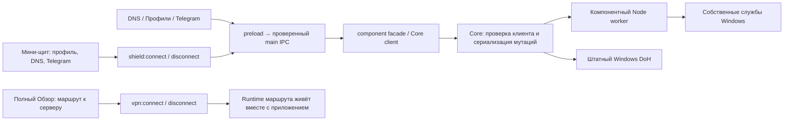

# Карта функций и аудит контрактов Egoist Lagom 3.8.0

Проверяемая база: commit `199236e3b227f9885c2beef64faffbe9e9a35583`. Это повторный аудит действующего исходного приложения, а не утверждение о работе новой сборки месяцами. Windows SCM, DNS, пользовательское приложение, сетевые настройки и реальные подписки при этой проверке не изменялись.

Проверены preload, все соответствующие main-обработчики, экранные действия, компонентный протокол, границы Core/worker/SCM и источники статусов. Полный каталог **117 методов invoke → 117 уникальных IPC-каналов** находится в `feature-contracts.json`. У всех найдены обработчики, повторной регистрации одного канала не найдено. Это проверка связности API, не доказательство успешного выполнения каждой Windows-команды.

## Какая версия интерфейса действительно собирается

`scripts/build.mjs:51–58` удаляет из recovered renderer функции `sp`, `cp`, `lp`, `ap` и вставляет `src/brand/ShieldWidget.jsx` и `src/brand/CompactRuby.jsx`. Поэтому старую главную страницу из `src/recovered/renderer.js` нельзя выдавать за действующий Обзор. Экраны Соединение, DNS, Профили, Telegram и Настройки сохраняются из recovered renderer, получают общие иконки/кнопки и брендовый CSS.

## Функции, зависимости и фактический результат

В столбце «Без GUI» речь о закрытом приложении, а не о скрытом окне/трее. Для действий нужен интерфейс либо проверенный вызывающий процесс; продолжение уже установленной службы — отдельный контракт.

| Поверхность / функция | IPC и исполнитель | Что действительно подтверждается | Без GUI / незакрытая проверка |
|---|---|---|---|
| Мини-щит: подключить | `shield:connect` → `ShieldConnectionController` → координатор → Zapret/DNS/TG | Выбор профиля, запуск собственного winws; DNS running + verified; TG service/listener readiness; откат только вновь запущенных частей при неудаче | Установленные службы продолжаются. Это не VPN и не подтверждение доступности всех сайтов |
| Мини-щит: отключить | `shield:disconnect` → восстановление owned DNS, остановка TG, standalone и службы Zapret | Readback остановки перед успешным результатом | Явное отключение снимает соответствующий автозапуск. Scope шире одного профиля |
| Мини-щит: отменить | `shield:cancel` → отмена автоподбора + проверки cancellation между шагами | Операция не объявляет успех после отмены; откат может требовать внимания | Отмена посреди реальной SCM/установки ещё требует Windows-приёмки |
| Мини-щит: DNS / TG | `system-doh:apply/reset`; `telegram-proxy:start/stop`; localStorage | При активном щите меняет компонент и читает статус; при выключенном щите переключает намерение «включить при подключении» | Один и тот же switch обозначает намерение или реальную активность; требуется явная подпись |
| Мини-щит: статус | `shield:status` + `shield:progress` | Компонентные статусы, ошибки чтения, блокировка действий при неизвестном состоянии; generation защищает от старых ответов | Polling 4 с видимо / 10 с скрыто. Это не автономный watchdog приложения |
| Полный Обзор: маршрут | `vpn:connect/disconnect` → VpnRuntimeManager | Runtime, локальный proxy, проверенный внешний egress; `wm` требует connected + egressVerified | При полном выходе маршрут отключается. Для reconnect/auto-connect нужен процесс приложения |
| Выбрать сервер на Обзоре | `state:set` | Сохраняет выбранный node ID для следующего подключения | Полный снимок вместо точечного изменения: FC-01 |
| Обзор: DNS | `system-doh:apply/reset` | Проверенный System DoH, выбор native/local пути; owned rollback | Native DNS/собственная служба продолжается без GUI |
| Обзор: Профили switch | `zapret:start-standalone`, `stop-service`, `stop-standalone` | Запуск/остановка owned процесса | Включение использует standalone и может отключить автозапуск уже установленной службы: FC-03 |
| Обзор: Telegram switch | `telegram-proxy:start/stop` | Windows путь start делегирует установленной службе, listener readiness | Установленная служба независима от GUI; явный stop отключает её автозапуск |
| Внешний IP, провайдер, регион | `vpn:get-my-ip`, network/health snapshots; verified egress предпочтительнее | Измеренный IP и доступные сведения; отсутствующие данные показываются отдельно | После изменения маршрута сведения до следующего обновления могут быть устаревшими; общий max-age пока не задан |
| Трафик | `traffic-update` → реальные Xray stats / sing-box stream | Только полученный числовой sample; при отсутствии sample «Нет данных», не выдуманный ноль | Main пропускает скрытое/минимизированное окно, сериализует sample, сбрасывает generation при смене сессии |
| Скорость и отмена | `vpn:speedtest`, progress, `vpn:speedtest-cancel` | Реальные download/upload/latency через route; отмена владеет своими sockets | Это отдельное измерение, не месячная стабильность и не скорость всех сайтов |
| Проверить выход / защиту | `vpn:route-probe` + `vpn:dns-leak-test` | Egress/proxy/route/DNS проверки с понятным ограничением; возможен inconclusive | Результат snapshot; необходимы checkedAt, инвалидирование при смене сети и ясная неполнота DNS leak проверки |
| Повторно применить маршрут | `vpn:reapply-route` | Точечное восстановление own proxy активной сессии | Требует приложения и активного runtime; не изменяет весь стек |
| Восстановить интернет | `system:internet-fix` → owned repair + connectivity probes | Откат только своих proxy/firewall/runtime изменений, DNS cache flush, проверка связности | DNS и TG сохраняются; UI показывает scope в подтверждении. Конфликтные сторонние компоненты не убиваются этим действием |
| Импорт с буфера / Ctrl+V | `system:read-clipboard` + `import:text` → resolver/parsers | URI/JSON/Clash/subscription parsing, explicit issues; подтверждённый atomic import | Чтение только по действию. Файл и pickFile доступны через API, видимой файловой кнопки в текущем экране нет |
| Обновить подписки | `subscription:refresh-all` / `refresh-one` → bounded fetch + parser + StateStore.update | Ограниченные HTTP budgets, до 4 запросов параллельно, сохранение старых узлов при пустом/ошибочном результате | Выполняется в приложении; UI refresh-all обновляет все enabled подписки |
| Подписка: имя, срок, трафик, удаление | `subscription:delete`; rename доступен в API | Удаляет подписку по URL и её узлы; не рвёт runtime автоматически | Панель смешивает первую подписку и провайдера активного узла: FC-09. Нет выбора цели и Undo/подтверждения |
| Сервер: выбор / избранное / сортировка | `state:set`; сортировка локальная | Реальные импортированные узлы, metadata.favorite, TCP latency | Полный снимок: FC-01. Полная DOM-карта всех узлов, виртуализации/поиска нет |
| Серверы: пинг | `vpn:ping` → measureTcpLatency | TCP-connect к конкретному server:port, не ICMP и не health всего маршрута | До 60 одновременно каждые 10 с плюс второй ранний batch; цикл не проверяет document.hidden, нет отмены in-flight при уходе с экрана |
| Пинг активного сервера | `vpn:ping-active-proxy` | Медиана трёх TCP-connect до выбранного узла, cache по processGeneration/node; coalescing | Не задержка Telegram/игры/всех сайтов. UI effect пропускает скрытое окно |
| Ручной DNS / пресеты | `system:set-dns-servers/reset-dns-servers` → Core owned DNS transaction | Применение к активным физическим адаптерам, readback/probes/rollback | Системная конфигурация продолжает действовать без GUI; Core следит за owned adapters |
| DNS-ссылка | `system-doh:apply` → secure DNS parser/native bootstrap/local Xray | Общий HTTPS DoH, loopback ownership, строгий upstream HTTPS; custom non-443 уходит в локальный путь | Общий DoT не реализован; UI умеет конвертировать только Gravityless DoT-hostname: FC-08 |
| DNS: текущий адрес и диагностика | `system:dns-controller-status`, `dns-diagnostics`, `system-doh:status` | Настройки активных адаптеров, named probes, режим native/local, verified | Часть режима берётся из сохранённого intent; прежний dnsCheck может пережить следующую мутацию до delayed refresh |
| Перепроверить / отключить DoH | `system-doh:restart/reset` | Повторное применение/проверка либо owned восстановление; pending adapter rollback блокирует остановку единственного resolver | Установленный local resolver/Windows DNS остаются самостоятельными |
| Профили: выбор и автоподбор | `zapret:list-profiles`, `auto-select`, progress, `cancel-auto-select` | Реальные проверки доступности набора targets, partial/cancelled history не выдаётся за полный выбор | Служба и DNS могут меняться; Core сериализует execution. Не доказывает все сайты/UDP voice/всех провайдеров |
| Профили: история / маршруты | `zapret:status`, `get-user-lists`, `save-user-lists` | История на диске/в UI, bounded compact results, domain/IP/CIDR списки | При активном VPN соответствующие изменения заблокированы после получения coordinated lock |
| Профили: обычный запуск | `zapret:start-standalone/restart-standalone/stop-standalone` | Detached owned winws и подтверждение PID/process readiness | Не SCM auto-start/recovery. UI обещание «остановится вместе с приложением» не согласуется с detached worker жизненным циклом; нужно отдельное испытание exit/crash |
| Профили: фоновая служба | `zapret:install-service/set-service-profile/start-service/stop-service/remove-service` | Owned wrapper/SCM и winws readiness; explicit start восстанавливает Auto, explicit stop Disabled | Продолжается без GUI и стартует после reboot при Auto. SCM healthy ≠ доступность всех целевых сайтов |
| Профили: игровой фильтр / IPSet | `set-game-filter-mode/set-ipset-mode/update-ipset-list` | Запись соответствующих runtime flags/lists; validation | Эффект требует проверки конкретного профиля/игры; UI не измеряет packet-loss/jitter |
| Flowseal update | `zapret:check-updates/install-core-update/install-core-version` | Защищённый runtime update, integrity и version readback, сохранение lists | Реальная rollback/update/reboot матрица на отдельной Windows ещё нужна |
| Кэш Discord / reset WinWS | `zapret:clean-discord-cache/reset-network-state` | Явно предупреждённый scope: закрытие названных Discord-клиентов/owned Zapret, cache/driver cleanup | Не фоновая оптимизация. Кнопки опаснее обычной настройки и должны оставаться в обслуживании |
| Telegram: конфигурация | `telegram-proxy:save-config` → schema + protected worker config | Loopback address, port, secret, limits; frontend сохраняет dirty draft при внешнем изменении | Хороший образец разделения draft/readback; сохранение выполняется перед install/start/openLink |
| Telegram: служба / управление | install/start/stop/restart/remove-service | SCM + ownership listener proof, endpoint availability; installed service остаётся при application shutdown | Стабильная локальная готовность не доказывает доставку сообщения в реальном Telegram-клиенте |
| Telegram: добавление в клиент | `telegram-proxy:open-link` | Открытие локальной proxy-ссылки в зарегистрированном клиенте | Не доказывает, что пользователь подтвердил применение и клиент использует proxy |
| Telegram: route/logs/update | `status/tail-logs/open-logs/check-updates/install-update` | Route/connection counters, bounded log tail, совместимый bundled headless runtime | Latest upstream desktop asset не устанавливается как service; UI должен различать upstream и installable |
| Настройки: startup/tray | `state:set` → syncWindowsLoginItemSettings | Login item + rollback при неудаче записи, persist window behavior | GUI auto-start нужен для VPN/обновления, а не уже установленных служб; мини-подключение всё ещё принудительно меняет три этих настройки: FC-07 |
| Настройки: auto-connect/reconnect | `state:set`; main boot DNS probe + reconnectSupervisor | Восстановление последнего маршрута и повторы с ограничениями | Без процесса приложения не работает. Startup readiness пока проверяет только DNS, а не интернет/captive portal |
| Настройки: уведомления/HWID | `state:set` → Notification checks / subscription fetch | Настройка notification gate; HWID default off, явный opt-in | Не подтверждено отсутствие всех сторонних runtime logs с персональными адресами |
| Обновление приложения | `updater:*` → signed registry/manifest/download/installer handoff | Root-pinned trust, anti-rollback/revocation/checksum, visible phases/errors | Работает при запущенном приложении/трее; автономного GUI-less updater нет. Для 3.7.7 нужна ручная миграция |
| Логи / диагностика | `logs:*`, `health:*`, `diagnostics:export-bundle` | Локальные logs/statuses/summary, JSON redaction, архив; diagnostic debug window ограничен | Path-based DNS credentials пока не скрываются: FC-02. 7-дневная очистка вызывается при startup/settings, а не непрерывным daemon timer |
| Версия / окно / мини / About | `app:*`, `window:*` | Реальная package version/date, native window mode, zoom policy, close/tray behavior | Recovery renderer отдельный от продолжения SCM служб; max/min geometry — в UI-аудите |
| Network plan API | `network:inspect/plan/approve/apply/rollback/verify/diagnose` | Inspect + coordination реальных действий; plan/approve есть, apply/rollback возвращают applied:false | Plan API не исполняет Windows-операции; verify проверяет plan/approval, не внешний сеть. В текущем UI plan workflow отсутствует |
| Legacy/advanced API | runtime install/update, process list/icon, usage history, TUN/process/domain rules | Методы/данные существуют, protocol matrix ограничивает runtime capabilities; killSwitch при sanitize принудительно false | Наличие поля или IPC не является обещанием текущей видимой функции. Не добавлять весь API в UI ради числа настроек |

## Приоритетные контрактные дефекты

### FC-01 · P1 · Сохранение настройки может удалить более новое состояние

Факты: экран Настройки `renderer.js:11341`, выбор/избранное `11170/11179` и новый server picker `CompactRuby.jsx:150` передают весь snapshot в `state:set`. Main `handlers-system.js:690–711` парсит и вызывает `stateStore.set(nextState)` без expectedRevision. `StateStore.set` (`state-store.js:188–190`) сериализует записи, но заменяет их устаревшим объектом. `patchSettings(expectedRevision)` уже реализован, **в этих IPC не используется**.

Воспроизведение на реальном StateStore и собственном временном профиле: взять renderer snapshot → добавить новый узел через StateStore.update → сохранить notifications из старого snapshot. До сохранения 1 узел, после сохранения 0 и на диске тоже 0. Это логическое воспроизведение настоящего модуля, не наблюдение потери реальной подписки пользователя.

Исправление: dedicated `settings:patch`, `node:select`, `node:set-favorite`; main применяет изменения к свежему state. Для editable settings — revision/conflict ответ. Привязать login item rollback к атомарному обновлению конкретных настроек. Также заменить `get()+set()` у rename/delete на `update(current => ...)`.

Приёмка: параллельно import/refresh, изменение настройки, выбор/избранное; сохранены оба независимых изменения. Старый settings revision возвращает conflict с актуальным readback. Ошибка диска не меняет memory/revision/login item.

### FC-02 · P1 · Токен в DNS URL попадает в диагностический архив

`diagnostics-redaction.js:10–20`: HTTPS URL без query/hash/credentials возвращается целиком. `redactDiagnosticObject` для `*url*` вызывает этот же текстовый redactor. `handlers-health.js:246–256` экспортирует `settings` и log после этой обработки.

Воспроизведение: собственный `https://dns.example.invalid/dns-query/AUDIT_SENTINEL_NOT_A_REAL_SECRET_9f5b` остался в object и text redaction. Реальный пользовательский URL не читался. Речь о локальном архиве, который пользователь может передать поддержке; автоматической отправки не обнаружено.

Исправление: URL-поля настроек экспортировать структурно как scheme/host/port/known template, pathname/query credentials скрывать. Для logs нужен общий path-redactor, согласованный с subscription redaction. Не менять рабочий endpoint ради redaction.

Приёмка: query, path, nested URL, WireGuard/UUID/password/secret, invalid URL и percent-encoding, синтетический corpus; после экспорта ни один secret sentinel не присутствует ни в одном ZIP entry, а hostname и код ошибки остаются полезны.

### FC-03 · P1 · Быстрый «Вкл» отключает постоянный запуск профиля

`CompactRuby.jsx:126–128` всегда запускает `startStandalone`, даже при installed stopped service. `zapret-manager.js:991–997` в этом случае меняет SCM start на Disabled. VM выполнял реальный authored callback с перехватом IPC: выбрана именно `startStandalone`, не `startService`; реального SCM-вызова не было.

Исправление: быстрый switch запускает установленную службу через startService; если службы нет, предлагает/устанавливает её с явным readback. Standalone остаётся отдельной временной командой в расширенном обслуживании. Отдельно уточнить lifecycle detached process: он не равен SCM recovery.

Приёмка: installed stopped Auto/Disabled → quick on → service Running/Auto + winws ready; reboot без GUI сохраняет профиль. При stop explicit состояние остаётся Disabled. «Временный запуск» явно не обещает reboot persistence.

### FC-09 · P1 · Неверная цель удаления при нескольких подписках

`renderer.js:11133`: срок/трафик/lastUpdated/delete используют `subscriptions[0]`, но provider строится по активному узлу через `fm` (`11621–11623`). `11194–11199` удаляет URL первой подписки; `11209` вызывает это напрямую без dialog. При выбранном узле второй подписки имя провайдера и объект удаления различаются.

Исправление: один selectedSubscriptionId для provider/quota/expiry/updated/delete, явный selector и target name в подтверждении либо Undo. `refreshAll` подписать «Обновить все подписки», если остаётся массовым действием.

Приёмка: две подписки с разными именами, сроками, quota и узлами; выбрать вторую; все поля/действия используют вторую. Удаление не сносит первую и не прекращает чужой active runtime.

### Остальные долги для плана

| ID / приоритет | Проверенное условие | Практическая доработка |
|---|---|---|
| FC-04 / P2 | Mini power управляет shield-пакетом; полный Обзор — VPN. Mini headline connected определяется ready Zapret, optional DNS/TG могут быть выключены. `ShieldWidget.jsx:93–98/251`, `CompactRuby.jsx:108–112` | Два явных объекта: «Фоновые компоненты» и «Маршрут через сервер». У обеих поверхностей одинаковые имена/состояния, без внезапной смены смысла слова «Подключить» |
| FC-05 / P2 | Full hot poll хранит предыдущий VPN/DNS/TG при reject (`renderer.js:10722–10725`); ни max-age, ни last-read error не отображаются общим контрактом. DNS check/IP route snapshots частично остаются до следующего refresh | Общий immutable observed snapshot: generation, checkedAt, source, effectiveState, expectedIntent, error, staleAfter. Старый known status допустим с явным «последнее подтверждение», но не как fresh ready |
| FC-06 / P2 | Node ping batch до 60 каждые 10 с не пропускает hidden window; список и picker строят все строки. Full poll запрашивает 6 статусов каждые 6/2 с и 13 источников раз в минуту, widget добавляет shield status | Сначала измерить 0/60/500/2000 узлов в собственном fixture: CPU/heap/DOM/p95 frame/IPC counts. Затем visibility-aware bounded queue/cancellation и виртуализация, только если измерения оправдали. Не объявлять «stutter» без measurement |
| FC-07 / P2 | `handlers-system.js:1473` после shield.connect принудительно включает autoStart/startMinimized/minimizeToTray | Сохранить только профиль/явный intent. Startup GUI — отдельная настройка для VPN и updater; SCM-компонентам не нужен этот побочный эффект |
| FC-08 / P2 | UI пишет «DoH URL / DoT hostname» и Android Private DNS; `renderer.js:11742–11756` поддерживает hostname только Gravityless | Уточнить допустимые форматы, показать неподдерживаемый DoT до начала операции; универсальный DoT реализовывать отдельным контрактом с сертификатом/портом/SNI, если он нужен |
| FC-10 / P2 | Main startup «networkReady» проверяет только resolve4(msftconnecttest), `main.js:897–903`; egress watchdog comment обещает ~24 с, но healthy period=45 с и retry=12 с | Не считать DNS ответ доказательством интернета. Проверять bounded HTTPS/captive signal или честно называть DNS readiness. Документировать detection budget: до 57 с плюс probe durations/IPC для отказа сразу после healthy probe, а не 24 с |

## Что уже сделано правильно

- Разделены process/service readiness и egress verification. TG ownership listener, Zapret own winws и DNS verified не заменяются одним SCM Running.
- Main mutations проходят coordinated locks; неизвестный ownership не является разрешением изменять сеть. Core/worker ещё раз проверяют границы и схемы.
- UI показывает неизвестный трафик отдельно; исключено обещание нулевого трафика при отсутствии measurement. Telegram dirty draft переживает внешний config update.
- Explicit отключение сохраняет намерение пользователя после reboot. Существующая остановка службы во время VPN используется отдельным temporary suspension путём.
- Network plan API честно возвращает applied:false; скрытый capability нельзя включать в список «всё работает».

## Проверки, которые нужно добавить к релизной матрице

1. Закрыть найденные P1 контрактные дефекты с failing-before/passing-after проверками. Старые StateStore.patchSettings unit tests не покрывают реальный renderer→state:set маршрут.
2. Пройти каждую видимую функцию через настоящий preload/main в изолированной Windows-приёмке; не подменять её наличием API/VM fixture. Для опасных сетевых действий — отдельная VM с сохранённым baseline, собственными адресами/сервером и readback после reboot.
3. Проверять службы без GUI: install→exit→reboot→readiness; explicit stop→reboot→остаются выключены; owned child crash→recovery; Core/worker crash→не ложный ready; внешняя смена adapter/DNS→ownership сохранён.
4. Проверить две подписки и concurrent edits, stale/pending/offline snapshots, выключенный tray/app, Windows logon/sleep/resume и captive portal. Измерять elapsed/error/recovery, а не только число успешных loops.
5. Мини-щит и полный режим: identical action names/scopes/readiness; DNS/TG planned vs active; поведение при ready Zapret + failed DNS/TG; внешний IP после переключения не выдаётся за свежий.
6. Долгий прогон: 72 часа лаборатории, затем 7–14 дней пилота со sparse counters (recovery/error/CPU/heap/disk), затем месячное наблюдение. Виртуальные месяцы scheduler-tests проверяют алгоритм, не Windows uptime.

## Evidence и предел проверки

`feature-contracts.json` фиксирует исходные hashes, 117 invoke→handler mappings, ссылочные функции и четыре проверки: три найденных несоответствия воспроизведены, связность IPC прошла. Скрипт evidence находится только в runtime проверяющего агента; итоговые результаты без пользовательских данных сохранены в проекте. Source hashes связывают выводы с проверенной версией.

Здесь не заявлены повторный запуск всех 633 тестов, реальная установка 3.8.0, длительный стресс-тест Windows, реальная доставка Telegram, измерение FPS или отсутствие всех конфликтов. Существующие тесты `state-store`, `ui-service-readiness`, `shield-connection-truthfulness`, `renderer-dns`, `network-races` полезны, но новый найденный маршрут lost update показывает, почему общий зелёный suite не заменяет проверку пользовательского сценария.
