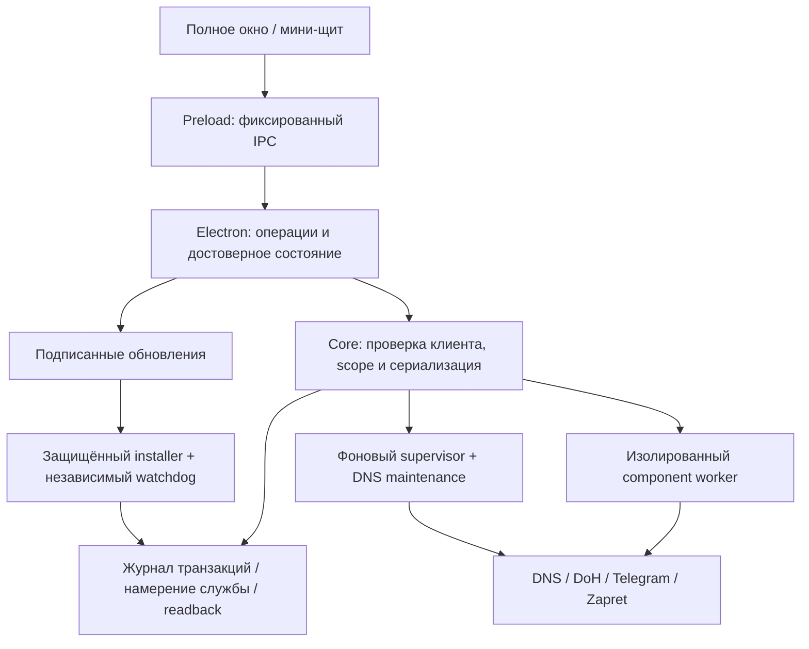

# План выпуска и дальнейшего развития Egoist Lagom

30.09.2026. База — публичная 3.7.9 (`d56eb9327fa75a88e91fae62b8d7ea3ed095dcf2`); текущая работа — кандидат 3.8.0. Цель: приложение, в котором пользователь понимает действующее состояние сети, безопасно включает компоненты, а установленные фоновые службы обслуживаются без открытого GUI. «100%» не используется как измерение качества или гарантия отсутствия отказов.

## Архитектура и границы

Фоновый Core, SystemDoH, Telegram и Zapret при установленном режиме службы не зависят от окна. Ручное выключение и Disabled имеют приоритет над восстановлением. Повтор действий ограничен и сопровождается проверкой фактического состояния. GUI по-прежнему нужен для существующего режима VPN/TUN и проверки обновлений приложения; перенос VPN/обновлений в полностью автономный daemon — отдельное изменение архитектуры и приёмки.

## Что реализуется в 3.8.0

| Область | Результат для пользователя | Проверяемое условие |
|---|---|---|
| HTTP, подписки, route probe | Незавершённое тело не держит кнопку/операцию бесконечно; отмена действительно прерывает ожидание | Deadline полного тела, ограничения размера, завершение ресурсов, отдельный signal каждой операции |
| Адреса и конфигурация | Ввод/подписка сохраняют точные server, URI и TLS SNI; удалённый выбранный узел не заменяется другим | Roundtrip и config contracts; ошибка при отсутствующем explicit ID |
| Статус | Неверный IP и недоступный SCM не превращаются в успешное подключение или уверенное «выключено» | Валидатор IP, unknown/degraded, поколения cache и readiness |
| Восстановление | Ошибка manual connect не выключает supervisor навсегда; коррекция часов не блокирует DNS maintenance | Fail-before/pass-after, bounded backoff, durable intent и отмена старого поколения |
| Core | Scope проверяется до replay; неподтверждённый protected root не допускает запуск службы | Memory/durable replay, ACL guard до SCM, совместимый query contract |
| Renderer | Падение допускает ограниченное восстановление, а не бесконечный цикл перезагрузок | Coalescing, 3 attempts/60s, OOM delay, отмена retired window, один настоящий crash |
| Installer | Версия соответствует manifest/PE; неверная принадлежность установки не входит в protected handoff; сохранённые WinSW заменяются проверенными байтами | Canonical path/health/version, distinct refusal code, не-рекурсивный /S, rollback и sharing fixtures |
| Длительная работа | Журналы оболочки не растут без какого-либо обслуживания | Три allowlisted пути, threshold/retention, monotonic schedule, отсрочка при lock без остановки службы |
| Обновление | Новый подписанный registry может отозвать ключ; повреждение/rollback не обходятся запасным транспортом | Pinned root, authenticated cache, monotonic floor, fresh/offline policy и видимое предупреждение |
| Сборка | Установщик связан с конкретными исходниками; копии native runtime сверены с pinned архивами | Clean commit/tree, свежая сборка frontend, locked restore, destination hashes, tag readback |
| Дистрибуция | Лицензии и направления получения исходников соответствуют фактически включённым компонентам | Хеши 276 файлов, 144 sourcearchives, 135 Go h1 checks; остаточные ограничения указаны отдельно |

## Продуктовый дизайн

Текущий контракт — [DESIGN.md](../../DESIGN.md), точные значения — `src/brand/tokens.css`. Сохраняются щит, монохром и компактный режим; Manrope улучшает читаемость плотных форм, Unbounded сохраняет бренд. Сетевые значения моноширинные. Иконки векторные и согласованные; состояния читаются по тексту и форме. Движение короткое, без поддельного прогресса, с reduced-motion и ограничением скрытых декоративных анимаций.

| Сценарий | Требуемое поведение |
|---|---|
| Первый запуск | Ясно показать отсутствующий маршрут, отдельно уже работающие службы; предложить импорт, не обозначать защиту включённой по сохранённому preference |
| Подключение | Выбранный сервер остаётся выбранным; pending блокирует повтор; успешный статус требует проверки, ошибка объясняет следующий доступный шаг |
| DNS | Показывать применённую конфигурацию и результат проверки отдельно; не скрывать отсутствие upstream connectivity за живым локальным listener |
| Профили | Различать выбранный профиль, SCM Running и измеренную работоспособность; история и маршруты доступны клавиатурой |
| Telegram | Разделять installed/running/listener/route; расширенные настройки доступны полностью, секрет password, журнал раскрывается внутри панели |
| Настройки | Описания видимы постоянно; help доступен hover/focus/Escape; запуск служб и запуск GUI объяснены отдельно |
| Мини-щит | Отдельный вход в полное окно, читаемая ошибка/повтор; connected check исчезает при hover/focus выключателя |
| Малое окно/200% | Одноколоночный поток использует высоту содержимого; соседние панели не накладываются, нижние действия достижимы прокруткой |
| Диалог | Label/description, focus trap, Escape, возвращение фокуса; действие и область изменения названы до подтверждения |

Реальный native capture выявил сжатие grid tracks под высокими панелями в пяти разделах. Оно исправляется у источника layout, а не маскируется увеличением минимального окна. Проверки ширины страницы дополнены проверкой вертикальных границ, нижних действий и настоящих UI interactions.

## Последовательность допуска к публичному выпуску

1. **Source freeze.** Все подтверждённые дефекты получают воспроизведение/регрессию; общий Node/C# набор проходит с настроенными внешними fixtures. Исходники, лицензии и evidence сохраняются отдельно от пользовательских файлов и ключей.
2. **Артефакт.** Из чистого commit собираются frontend/main/worker, Core и NSIS. Проверяются manifest, PE version, ASAR, каждый обязательный payload, sourcecompanion и SHA. PlanOnly использует настоящий новый EXE. При несовпадении source/tag выпуск блокируется.
3. **Чистая Windows-приёмка.** На отдельной Windows 10/11 проверить first install, install over3.7.8/3.7.9, повторный запуск installer, rollback при обрыве, uninstall и reboot. Сохранить DNS families, намерения служб, отсутствие новых сторонних изменений; намеренно выключенные службы не должны оживать.
4. **Отказные сетевые сценарии.** Смена DHCP/Wi-Fi/Ethernet, sleep/resume, offline→online, смена адреса upstream, недоступный DoH, занятой listener и SCM/AV failure. Подтвердить точное восстановление без GUI и отсутствие restart storm. Внешняя доставка VPN/Telegram проверяется отдельно от локального listener.
5. **Soak.** Минимум72ч непрерывного испытания с журналом RSS/handles/threads/disk, затем7–14дней pilot. Не ускорять календарное время вместо наблюдения ОС. Acceptance: отсутствие необъяснённого роста, восстановления чужих listeners, DNS drift и потребности в ручном переподключении. Заявления о месяцах возможны только после соответствующей длительности наблюдения.
6. **Native maintenance/source gate.** Решить замену EOL log4net внутри WinSW и подтверждение corresponding source/build inputs. Наличие archive с исходниками не подтверждает идентичную пересборку и не завершает проверку всех transitive obligations.
7. **Подпись/публикация.** Проверить release manifest текущей цепочкой, загрузить точные артефакты, прочитать tag/asset hashes обратно; затем проверить новый installed-client update. Authenticode требует отдельного действующего сертификата издателя; подпись обновления не является Windows publisher signature.

## Следующая архитектурная итерация

После допуска кандидата приоритет — сопровождение, а не декоративная смена всех экранов. Восстановленный монолит `src/recovered/renderer.js` постепенно переносится в обычные исходные компоненты по одному разделу с сохранением IPC contracts. Общая модель `intent / observed state / readiness / lastError` заменит дублирующие локальные флаги. Native service host получает поддерживаемые зависимости и собственный source-to-binary pipeline. Диагностика добавляет причину последнего восстановления, точное время и privacy-safe export. Автономный VPN и обновление без GUI проектируются только после проверки daemon ownership и безопасного переключения маршрута.

Эти пункты остаются планом до реализации и приёмки. Ни один из них не записывается как уже выполненное улучшение.
